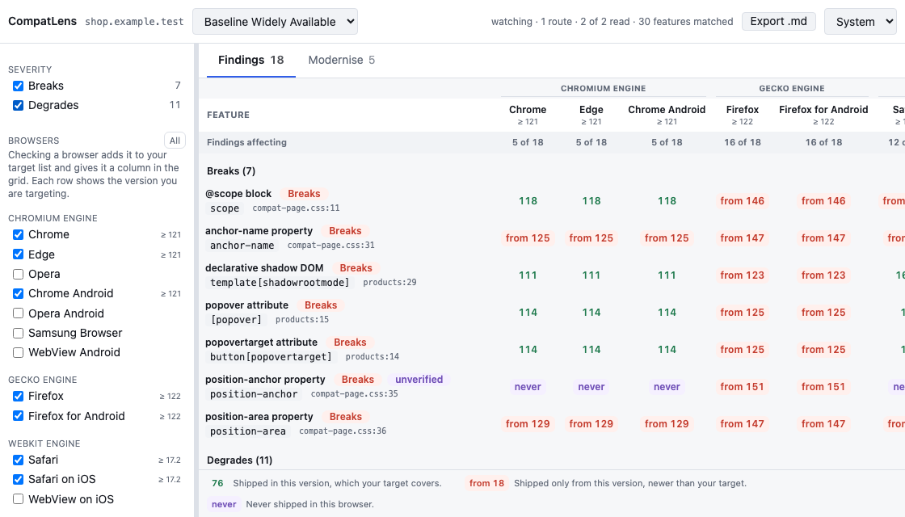

# CompatLens

A DevTools panel for Chrome and Firefox that watches the page you are inspecting and reports
cross-browser compatibility risks in its HTML and CSS. Nothing leaves your machine.

<picture>
  <source media="(prefers-color-scheme: dark)" srcset="docs/media/readme-panel-dark.png">
  
</picture>

Regenerate the images with `pnpm screenshots`. They render the panel over the fixture page in
`e2e/fixtures`, so every version in them comes from browser-compat-data rather than from a mockup.
The two `store-in-devtools` images add a drawn window and tab strip around two live frames, one of
the page and one of the panel, because a DevTools panel cannot be screenshotted by a script. Every
pixel inside those two frames is the real thing; the chrome around them is not.

## What it does

Open the panel and it starts watching. There is no scan button and no reload step. A
`MutationObserver` in the page reports elements as they arrive, the panel drains that queue every
750 ms, and findings accumulate for as long as the panel stays open. That matters for single-page
apps. Tested against Chrome 151, a `pushState` route change raises no navigation event, so a
one-shot scan sits there showing the route you left twenty minutes ago.

Findings are matched against 34 curated features, each pinned to a real `@mdn/browser-compat-data`
path and a `web-features` ID. Eight are HTML (`<dialog>`, `inert`, `popover`, `loading`,
`fetchpriority` and friends), twenty-six are CSS (`@container`, `@layer`, `@scope`,
`@starting-style`, `:has()`, `anchor-name`, `subgrid`, `oklch()`, `color-mix()` and so on).

Every finding is ranked **Breaks** or **Degrades**. That ranking comes from the catalog and is never
overwritten by a gap in the data. Open a finding and the drawer tells you what users
actually see, the first supporting version in each targeted browser, and an MDN link.

Sometimes browser-compat-data has no plain release number to compare against: support is prefixed,
renamed, flagged, partial, or was added and later removed. CompatLens treats that as *not supported*
rather than quietly passing it, and marks the finding **unverified** so you know the verdict rests on
an absence. The chip sits beside the severity label, never in place of it.

A second tab, **Modernise**, lists legacy CSS worth replacing. Seven rules ship today, covering
`-webkit-appearance`, `-moz-appearance`, `-webkit-clip-path`, `-webkit-backdrop-filter`,
`:-webkit-any()`, the withdrawn `:matches()` and `position: -webkit-sticky`. A suggestion only
appears when its modern replacement already passes on every browser in your target, so taking the
advice can never introduce a new finding.

**Export .md** in the top bar downloads the whole report as Markdown: every finding with its file and
line, the browsers it fails on, the fallback to use, and the modernisation list. It is written to be
handed to a coding agent as the brief for a fix, so it carries the targeted browser versions and
every warning rather than only the findings.

Where a stylesheet ships a source map, findings name the file it was written in rather than the built
one, in the grid and in the export alike. A map written into the stylesheet as a `data:` comment is
read from the text, which is how a development build of styled-components or emotion ships one; a
separate `.map` file is fetched from the page's own context. The served position is kept behind the
resolved one, so a stale map shows up as a disagreement rather than quietly replacing the truth.

### Targets

Pick one of three presets from the top bar. Changing it re-judges the whole page.

| Preset | Browsers it pins |
| --- | --- |
| Baseline Widely Available (as of 2026-07-30) | Chrome 121, Edge 121, Chrome Android 121, Firefox 122, Firefox for Android 122, Safari 17.2, Safari on iOS 17.2 |
| Baseline 2022 | Chrome 108, Firefox 108, Safari 16, Safari on iOS 16 |
| Browser age, 1 to 15 years | the oldest release of each browser still inside the window |

The age window defaults to 4 years and is stepped with the `−` and `+` buttons beside the picker.
Windows are computed from BCD release dates against a pinned snapshot date, not from the clock, so
the same preset resolves the same way until the datasets are regenerated. A browser with no release
inside the window drops out of the target entirely: Edge Legacy reappears at 8 years and Internet
Explorer at 13.

### Browsers

The left rail lists fourteen slots, grouped by rendering engine. Below 720px, which is where a panel
docked to the side of the window usually sits, the rail is replaced by a ☰ button that opens the same
severity and browser filters in a modal drawer. It closes on Escape, on a backdrop click, and by
itself when the panel is widened past 720px, handing focus back to whichever control replaced it.

| Group | Slots |
| --- | --- |
| Chromium Engine | Chrome, Edge, Opera, Chrome Android, Opera Android, Samsung Browser, WebView Android |
| Gecko Engine | Firefox, Firefox for Android |
| WebKit Engine | Safari, Safari on iOS, WebView on iOS |
| Legacy Engine | Internet Explorer, Edge Legacy |

A slot sits in the group of the engine it ran at the version you are targeting, so Edge moves from
Chromium to Legacy once your window reaches back past version 79. Chrome, Firefox, Safari and Safari
on iOS are ticked on first run; the rest are one click away. Ticking a browser your target has no
version for keeps the row but marks it dormant rather than inventing a version for it.

The grid gives one column per ticked browser that the target actually covers, with the engine name
spanning its columns above them. A cell reads as the version the feature shipped in, `from 18` when
that version is newer than your target, or `never`. Click a column header to rank the findings that
fail on that browser first; click **Feature** to sort by name. Rows always group under their
severity, and the rail has a checkbox per severity if you only want to look at one.

## Install from source

You need Node 24 and pnpm 11.20 or newer. `corepack enable` will pick up the version pinned in
`package.json`.

```bash
pnpm install
pnpm build
```

In Chrome:

1. Open `chrome://extensions`.
2. Turn on **Developer mode**.
3. **Load unpacked**, and select the `dist` folder.
4. Open DevTools on any page and pick the **CompatLens** panel.
5. Use the page. Findings appear as it renders.

In Firefox, run `pnpm package` first, since the Firefox manifest is not part of a plain build:

1. Open `about:debugging#/runtime/this-firefox`.
2. **Load Temporary Add-on**, and select `dist-firefox/manifest.json`.
3. Open DevTools on any page and pick the **CompatLens** panel.

`pnpm package` runs the build, checks both manifests and the output, then writes
`artifacts/compatlens-<version>.zip`, `artifacts/compatlens-firefox-<version>.zip` and the
`dist-firefox` folder. The two archives hold identical files apart from `manifest.json`: Chrome
rejects a package carrying `browser_specific_settings`, and addons.mozilla.org needs the `gecko.id`
that key holds.

## How it reads the page

There is one view of the markup, the rendered DOM. CompatLens does not read the HTML the server
sent.

A single evaluated expression installs the `MutationObserver` on `document.documentElement` and
stashes added elements on `window.__compatlensObserver`. The whole document is queued at install
time, because an observer on its own reports only what is new, and queued again whenever you change
the target, because that re-judges everything already on screen. `inspectedWindow.eval` is
request and response, so the page stashes and the panel drains; the drain serialises each queued
element with `outerHTML`, walks it for shadow roots, and appends each root's `innerHTML` as its own
fragment. Without that walk a component built with `attachShadow()` would scan as an empty tag.

If more than 2000 elements pile up between drains the overflow is counted and reported in the panel.
It is never dropped in silence.

Stylesheets do not mutate the way markup does, so they are re-read once per drain that produced
markup or a page-fetched stylesheet. `inspectedWindow.getResources()` lists what the page has
loaded, the DevTools network log
supplies the MIME types that listing omits, and anything served as `text/css` or ending in `.css`
has its body fetched. `data:` URLs are skipped: such a URL is its own content.

Not every browser hands a body back. Firefox implements no `getResources()` and attaches no reader
to its network log entries, which would leave every external stylesheet unread. So the page reads its
own as a second source: the observer walks `document.styleSheets` and `fetch()`es each `href` once,
from the page's own context and usually out of the HTTP cache. That needs no permission, since the
page is asking for a file it already loaded. The result lands in the stash and crosses over on a
later drain, because `eval` cannot wait for a promise. A DevTools body wins wherever there is one, it
can reach cross-origin sheets a page-context `fetch` cannot, and each URL is analysed once. A
stylesheet neither source could read is skipped, and the panel says so rather than looking clean.

Parsing runs in a Web Worker, which keeps parse5 and PostCSS off the panel thread. Serialising and
draining still happen on it. parse5 handles the markup,
PostCSS the stylesheets. Detection walks the AST rather than searching for substrings: `details[name]`
matches only a `<details>` element, selector detectors parse selectors, and value detectors parse
declaration values. Inline `<style>` blocks are lifted out of the markup and run through the CSS
detectors with their line numbers rebased onto the host document.

Serialised markup and parse trees are dropped as soon as findings come out of them. Each occurrence
is keyed by feature, URL and tree path (`html:nth-of-type(1)>body:nth-of-type(1)>div:nth-of-type(2)`),
so an element that survives fifty drains is still one row. The session caps at 5000 occurrences and
says so in the panel when it gets there.

Line numbers are worth understanding before you trust one. A finding in a stylesheet points at that
stylesheet, and its line is the line in your file. Everything else is located inside whatever the
browser handed back for one mutation, which is usually a small subtree, so the number is an offset
into that fragment and not into anything you can open. Inline `<style>` findings sit in between:
they are CSS, but their line is rebased onto the serialised markup rather than onto a file.

## Data sources

Compiled into the extension by `pnpm generate`, which reads a pinned snapshot date rather than the
clock and is therefore byte-reproducible. CI regenerates the registry and fails on any diff.

| Dataset | Pinned version | Licence |
| --- | --- | --- |
| [`@mdn/browser-compat-data`](https://github.com/mdn/browser-compat-data) | 8.0.9 | CC0-1.0 |
| [`web-features`](https://github.com/web-platform-dx/web-features) | 3.34.3 | Apache-2.0 |
| [`baseline-browser-mapping`](https://github.com/web-platform-dx/baseline-browser-mapping) | 2.11.12 | Apache-2.0 |

The generator throws if a curated detector names a BCD path or a web-features ID that does not
exist, and separately if `BrowserId` drifts out of step with the browsers BCD knows about. Runtime
code imports the generated registry only, never the upstream packages.

## Privacy and permissions

Neither manifest requests permissions. Not `storage`, no host permissions, no `<all_urls>`. What
they declare is a manifest version, a name, a version, a description, a devtools page, four icons
and the oldest browser the panel's own stylesheet runs on, which is Chrome 111 and Firefox 128; the
Firefox one carries that in the `browser_specific_settings` block that also holds the add-on id.
`pnpm package` fails the build if a `permissions` or `host_permissions` key ever appears in either,
or if the Chrome floor goes missing.

Nothing is persisted. Your theme, target and filters live in memory while the panel is open and are
gone when you close it.

[docs/privacy.md](docs/privacy.md) covers exactly what is read and what is kept.

## Architecture

```text
src/
  components/
    features/          live-panel, with partials/ and utils/ beside it.
    ui/                Reusable components, one kebab-case folder each; some are domain-typed.
  lib/
    engine/            Framework-free analysis. detectors/ holds the parse5 and PostCSS matching.
    compat-data/       Curated detectors, modernisation rules, the generated registry, scripts/ to write it.
  model/
    session/           The accumulating live session.
    target/            Target presets and age windows.
  extension/           DevTools adapters, with devtools-api/ holding the observer and the narrow facade.
  workers/             The analysis worker, its client, and the versioned message contract.
  utils/               Framework-free helpers shared across layers.
  preview/             A fixture panel built only by `--mode preview`, for the Playwright suite.
  shims/               Ambient Vite types.
  styles/              Tokens, the Tailwind theme bridge, global rules.
  Main.tsx             Panel entry.
  devtoolsMain.ts      DevTools page entry; registers the panel.
__mocks__/             Test data and global setup, imported as `@mocks`.
e2e/                   Playwright specs and fixtures.
manifest.firefox.json  The Firefox manifest, kept out of public/ so a plain build cannot ship it.
```

Layers talk through typed interfaces. `lib/engine` knows nothing of Chrome or Solid and runs inside
the worker, `model` is pure state, `components` only present. The ambient `chrome` global is touched
in exactly two files, `Main.tsx` and `devtoolsMain.ts`, and everything below them takes a narrow
`ChromeDevToolsFacade` instead.

Three places can hold a helper, and the signature decides which. `src/utils` takes anything with no
domain type in it, which is why `cx`, `toggleIn` and `playExitAnimation` sit there. A `utils/` folder
beside a component takes real logic, a branch or a loop or a comparator, bound to that one component
or feature. Types and literal constants stay in the component file with the props interface they
describe: they carry no condition, so nothing is hidden by the coverage exclusion. A file named
`*Utils.ts` that turns out to declare only types is in the wrong place.

## Development

```bash
pnpm check          # lint, typecheck, tests at 100% coverage, production build
pnpm test:watch     # unit tests
pnpm e2e            # Playwright layout, theme, contrast and keyboard checks
pnpm generate       # rebuild src/lib/compat-data/generatedRegistry.ts from the pinned datasets
pnpm icons          # re-render the PNG icons from icon.svg
pnpm package        # validate both manifests and build the Chrome and Firefox archives
```

Coverage thresholds are 100% for lines, branches, functions and statements. Solid components,
bootstrap entries, barrels, type declarations and the generated registry are excluded in
`vitest.config.ts`, each with its reason beside it; every condition a component renders lives in a
`*Utils` module that is covered. Anything a test writes to stderr fails the run.

The Playwright suite serves `preview.html` from a preview build rather than loading the extension, so
it stays about layout, theme and keyboard behaviour, and it drives the injected observer expressions
against a real page for the parts happy-dom cannot model. The fixture host cannot reach a production
build: it is not an input outside `--mode preview`, and `pnpm package` greps the output for it anyway.

## Screenshots

| | |
| --- | --- |
| [Findings, light](docs/media/store-grid-light.png) | [Findings, dark](docs/media/store-grid-dark.png) |
| [Detail sheet, light](docs/media/store-detail-light.png) | [Detail sheet, dark](docs/media/store-detail-dark.png) |
| [Modernise, light](docs/media/store-modernise-light.png) | [Modernise, dark](docs/media/store-modernise-dark.png) |
| [Narrow, light](docs/media/readme-narrow-light.png) | [Narrow, dark](docs/media/readme-narrow-dark.png) |
| [In DevTools, light](docs/media/store-in-devtools-light.png) | [In DevTools, dark](docs/media/store-in-devtools-dark.png) |

## Contributing

Standards, the commands that gate a change, and what will get one rejected are in
[CONTRIBUTING.md](CONTRIBUTING.md). Testing rules are in [docs/testing.md](docs/testing.md).

## Limitations

- JavaScript is not analysed. Loaded HTML and CSS only.
- Only elements as they are added are read. The observer watches `childList` and walks added nodes,
  so script that sets `inert`, `popover` or `loading` on an element already on the page produces no
  finding until that element is inserted again.
- An element added and removed inside one 750 ms drain is never serialised, because the drain only
  keeps what is still connected. Unlike the 2000-element overflow, that is not counted or warned
  about.
- A `style="..."` attribute is never parsed as CSS. Only `<style>` blocks are lifted out, and the
  HTML detectors read attribute names rather than their values.
- HTML line numbers are offsets into the mutation fragment they were found in, not positions in a
  file. Inline `<style>` findings are CSS but carry the same caveat.
- The served HTML is never read, so nothing is checked against the bytes your server sent. Against
  Chrome 151, `inspectedWindow.getResources()` lists the main document but returns no usable body
  for it, and the network log only holds it when DevTools was open for the navigation. Stylesheets
  are different: `getResources()` does return bodies for those, including ones loaded before
  DevTools opened.
- Findings are per feature and location. There is no autofix.
- The catalog is 34 hand-curated features, not the whole of BCD.
- `data:` URL stylesheets are skipped by design, since such a URL is its own content.
- A stylesheet served from another origin without CORS headers cannot be read by the page-context
  fetch, which is the fallback path. Chrome's `getResources()` still returns its body, so nothing is
  lost there. On a browser without that API the sheet is unreadable, its findings are missing, and
  the panel warns rather than reporting a clean page.
- Source maps resolve CSS positions only. HTML has none. A stylesheet that names a map the page
  cannot fetch, or fetches but cannot parse, keeps its served position and warns either way, so a
  poorer position is never passed off as a resolved one; the export also keeps telling you to enable
  source maps for those findings.
- CSS-in-JS is read only where the rules are in the page. styled-components and emotion put their
  CSS in a `<style>` element's text in development, and that is scanned like any other inline block.
  A production build of either inserts its rules through `CSSStyleSheet.insertRule` instead, which
  leaves the element empty, so the rules exist only in the CSSOM and nothing reaches the scanner.
  Those sheets are counted as unreadable and the panel warns, rather than reporting a clean page.
- An occurrence is keyed by feature, URL and tree path, so two elements at the same position in
  structurally identical markup are one finding. That is what makes a component used fifty times
  report once, and it is also why two different shadow roots with the same shape collapse together.
- Inline `<style>` findings are located by the tree path of the block they came from, so the line
  still describes the serialised markup rather than a file you can open.
- The declarative shadow DOM detector matches `<template shadowrootmode>`. Since findings come from
  the live DOM, and the browser consumes that template while parsing, the detector is unlikely to
  fire on a page that used the feature successfully.
- Modernisation covers prefixed and withdrawn CSS only, and each rule needs its modern replacement to
  already be in the catalog.
- No automated test loads the extension into a browser, in either engine. Playwright cannot reach a
  DevTools panel's `chrome.devtools` APIs, so the suite exercises the injected expressions against a
  real Chromium page and the panel against a served preview build. The DevTools API surface itself is
  checked by hand on both browsers before a release.

## Licence

Apache-2.0. See [LICENSE](LICENSE).

The compiled dataset is a derived subset of MDN browser-compat-data (CC0-1.0) and web-features
(Apache-2.0). Both are credited in [NOTICE](NOTICE).
